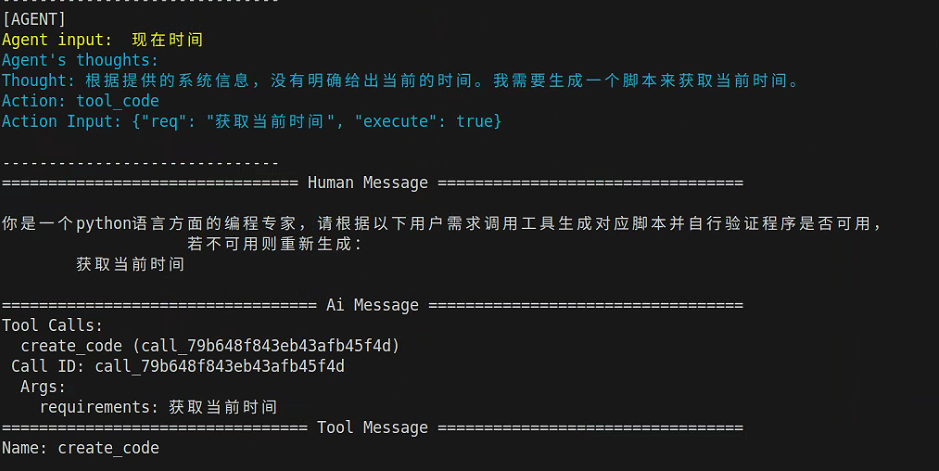
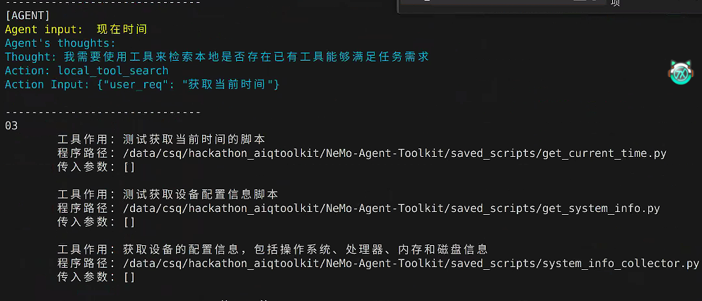
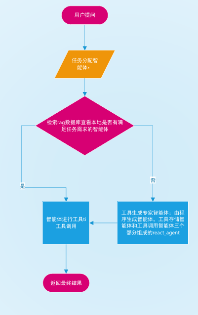

# 基于NVIDIA NeMo Agent Toolkit的AI对话机器人自动生成工具小助手

> 🏆 **黑客松项目** - 基于NVIDIA官方NeMo Agent Toolkit构建的智能对话机器人，展示AI Agent的强大功能

## 🎯 项目简介

我们的作品是一个集成了工具生成与工具调用能力的小工具助手智能体，旨在帮助动手操作能力较弱的用户更高效地与计算机设备进行交互。该智能体系统由工具调用智能体和工具生成智能体两部分组成，协同完成用户任务。工具调用智能体首先在本地向量数据库和MCP（Model Context Protocol）服务器中检索是否已有合适的工具可用；若未能找到匹配工具，则自动启动工具生成智能体。后者通过模拟代码工程师与测试工程师的角色分工，完成新工具的编写与验证。新工具制作完成后，系统会自动将其相关信息存储至向量数据库中，便于后续快速检索与复用。

以下为系统关键流程与组成结构的示意图：

*图示：工具生成智能体协作生成并测试新工具的过程*

*图示：工具调用智能体从向量数据库和MCP服务器中检索工具的工作流程*

*图示：系统整体架构，展示双智能体协同工作机制与数据存储关系*

## 📝 附注

由于完整程序上传出现故障，上传部分被修改内容：

- `tool`文件夹替换原项目：`hackathon_aiqtoolkit\NeMo-Agent-Toolkit\src\nat\tool`文件夹
- `xzs_config.py`放置于`hackathon_aiqtoolkit\NeMo-Agent-Toolkit`下并将文件内容的`apikey`进行替换
- 其余安装方式均与原项目相同
